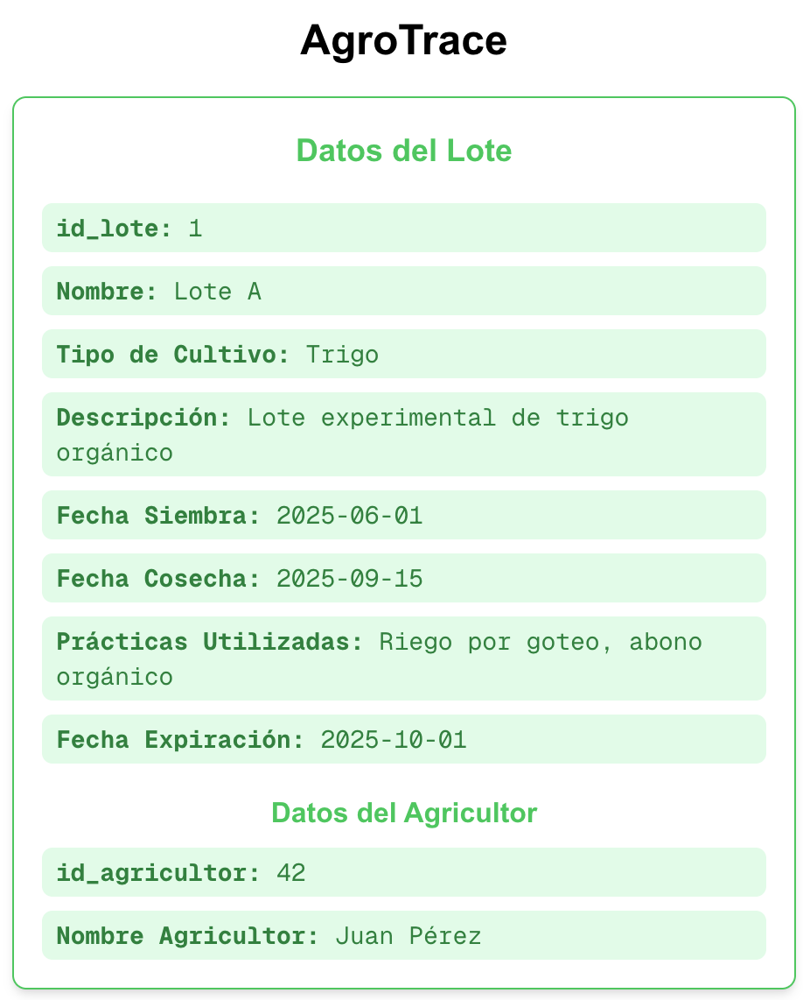

# dApp con Ethers.js
Nuestra dApp en Next.js usa Ethers.js para conectar MetaMask o un RPC de Polkadot Hub, leer datos del contrato. Gracias a esto, el usuario puede ver los datos on-chain directamente en el navegador.

Más detalles en:
https://papermoonio.github.io/polkadot-mkdocs/tutorials/smart-contracts/launch-your-first-project/create-dapp-ethers-js/#set-up-the-project