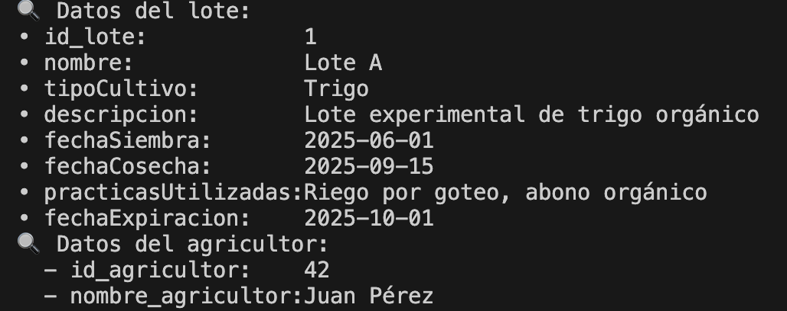

## Project Structure

# Ethers.js + Polkadot Hub

Este proyecto integra un contrato inteligente en Solidity usando Ethers.js, permitiendo su compilación, despliegue e interacción sobre Polkadot Hub. Gracias a los smart contracts, pudimos extender la funcionalidad de nuestra aplicación AgroTrace de forma segura y descentralizada.

Para más detalles sobre cómo utilizar Ethers.js con Polkadot Hub, visita:

[https://papermoonio.github.io/polkadot-mkdocs/develop/smart-contracts/libraries/ethers-js/](https://papermoonio.github.io/polkadot-mkdocs/develop/smart-contracts/libraries/ethers-js/)

